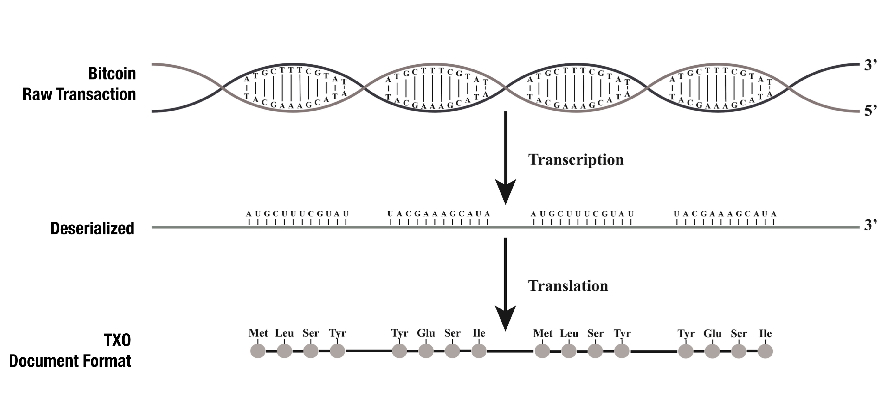
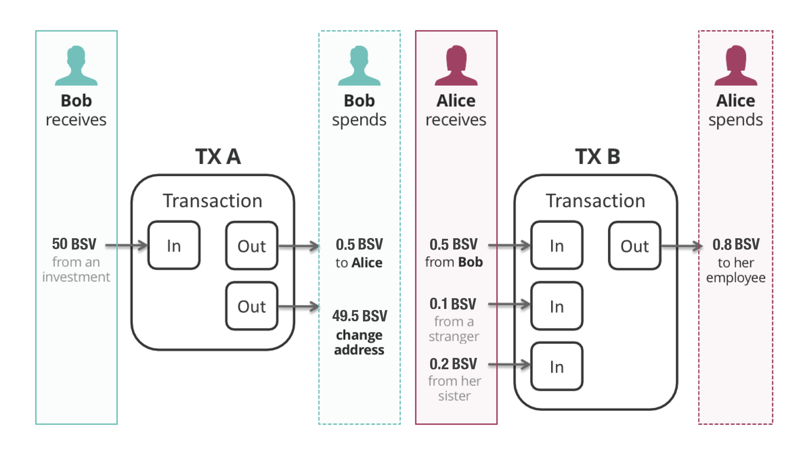

# TXO

> Transaction Object

TXO translates raw bitcoin transaction into JSON format, which can be:

1. stored in a document database (such as MongoDB) for powerful queries
2. filtered in realtime using JSON filter libraries (such as JQ)



TXO can be used as a standalone tool for quickly making sense of bitcoin raw transactions, and also powers [Planaria](https://docs.planaria.network), which passes the parsed TXO object to event handlers to let programmers build their own API Microservices, such as [BitDB](https://bitdb.network).


# Installation

```
npm install --save txo
```


# Usage

There are two methods:

1. **fromTx:** Generates JSON from raw transaction (Local operation and doesn't require a bitcoin node)
2. **fromHash:** Generates JSON from transaction hash. (requires a local bitcoin node for JSON-RPC)


## 1. fromTx

Generate JSON from raw transaction string.

The following code does the same thing as the `fromHash` example above, but doesn't require a bitcoin node since it's directly transforming from raw transaction.

```
const txo = require('txo');
(async function() {
  let result = await txo.fromTx("0100000001d5001345e77e66fa74f0012a81017ea1223c7a8adbcc9e37f2860f95ba97966d000000006b483045022100c1a0c5ffc5b78e39acb5be1438e28a10e5aac8337f5da7e4c25ba4c5f3eb01b5022050e9997bae423585da52d7cdc8951379f5bff07adb6756ffe70e7c7181f8a5bd4121032b345f89620af75f59aa91d47cc359e4dd907816ce0652604922726025712f52ffffffff024a976200000000001976a914c6187747f80b85170eef7013218e7b0fa441479988ac44033f00000000001976a9147e4616b7453185a5f071417bb4ac08e226dbef9888ac00000000")
  console.log(result)
})();
```

You can also pass an additional argument `{ h: true }` to ask for `h` attributes (hex encoded version of each pushdata) You can learn more about how each push data chunk is represented on the [script section](https://github.com/interplanaria/txo#level-2-script).

```
const txo = require('txo');
(async function() {
  let result = await txo.fromTx(
    "0100000001d5001345e77e66fa74f0012a81017ea1223c7a8adbcc9e37f2860f95ba97966d000000006b483045022100c1a0c5ffc5b78e39acb5be1438e28a10e5aac8337f5da7e4c25ba4c5f3eb01b5022050e9997bae423585da52d7cdc8951379f5bff07adb6756ffe70e7c7181f8a5bd4121032b345f89620af75f59aa91d47cc359e4dd907816ce0652604922726025712f52ffffffff024a976200000000001976a914c6187747f80b85170eef7013218e7b0fa441479988ac44033f00000000001976a9147e4616b7453185a5f071417bb4ac08e226dbef9888ac00000000",
    { h: true }
  )
  console.log(result)
})();
```


## 2. fromHash

The `fromHash` method utilizes Bitcoin's JSON-RPC, therefore you need to have access to a JSON-RPC endpoint.

The first step is to update the `.env` file

```
BITCOIN_USERNAME=[Bitcoin Node Username]
BITCOIN_PASSWORD=[Bitcoin Node Password]
BITCOIN_IP=[Bitcoin Node IP]
BITCOIN_PORT=[Bitcoin Node Port]
```

Then, we can generate TXO from transaction hash:

```
const txo = require('txo');
(async function() {
  let result = await txo.fromHash("45c6113bb1ecddc976131022bc80f46684d8956ab1a7bb5fc5625b5f7a930438")
  console.log(result)
})();
```

prints:

```
{
  "tx": {
    "h": "45c6113bb1ecddc976131022bc80f46684d8956ab1a7bb5fc5625b5f7a930438",
    "r": "0100000001932af0ab2a31ff4ac5454f4e3c71eaf137e11af8a658e590174d5da52612ecb6010000006b4830450221008892b5a2325c06c51a6b7a027432b681d02d11ba827b3e8212fad5297bfb09c20220569cf8ec522572761f0b5f885034a213c4e274c836736f45bbda78f4de1f6f1a412103b0127dc8d784b6925edbea960d4367d050fc0bd15a4a30a850c7d7787c3dd8a3ffffffff020000000000000000fd09016a067374617475734cff7b2276657273696f6e223a22302e312e30222c2274696d657374616d70223a313535313231343734312c2264617461223a7b22627376223a7b227072696365223a37332e35332c2274785f6e756d5f323468223a353330337d2c22626368223a7b227072696365223a3133312e37392c2274785f6e756d5f323468223a31333239347d2c22627463223a7b227072696365223a333831372e37312c2274785f6e756d5f323468223a3333333434307d7d2c22736f75726365223a7b227072696365223a2268747470733a2f2f6269746b616e2e636f6d222c2274785f6e756d5f323468223a2268747470733a2f2f626c6f636b63686169722e636f6d227d7d383d2200000000001976a914d330a4778ee282f5f3ed9cb2df1efbac198a970888ac00000000"
  },
  "in": [
    {
      "i": 0,
      "b0": "MEUCIQCIkrWiMlwGxRpregJ0MraB0C0RuoJ7PoIS+tUpe/sJwgIgVpz47FIlcnYfC1+IUDSiE8TidMg2c29Fu9p49N4fbxpB",
      "b1": "A7ASfcjXhLaSXtvqlg1DZ9BQ/AvRWkowqFDH13h8Pdij",
      "str": "30450221008892b5a2325c06c51a6b7a027432b681d02d11ba827b3e8212fad5297bfb09c20220569cf8ec522572761f0b5f885034a213c4e274c836736f45bbda78f4de1f6f1a41 03b0127dc8d784b6925edbea960d4367d050fc0bd15a4a30a850c7d7787c3dd8a3",
      "e": {
        "h": "b6ec1226a55d4d1790e558a6f81ae137f1ea713c4e4f45c54aff312aabf02a93",
        "i": 1,
        "a": "1LFfrDM27KXeUn1xH9NTknWHexTxqiEcnF"
      }
    }
  ],
  "out": [
    {
      "i": 0,
      "b0": {
        "op": 106
      },
      "b1": "c3RhdHVz",
      "s1": "status",
      "b2": "eyJ2ZXJzaW9uIjoiMC4xLjAiLCJ0aW1lc3RhbXAiOjE1NTEyMTQ3NDEsImRhdGEiOnsiYnN2Ijp7InByaWNlIjo3My41MywidHhfbnVtXzI0aCI6NTMwM30sImJjaCI6eyJwcmljZSI6MTMxLjc5LCJ0eF9udW1fMjRoIjoxMzI5NH0sImJ0YyI6eyJwcmljZSI6MzgxNy43MSwidHhfbnVtXzI0aCI6MzMzNDQwfX0sInNvdXJjZSI6eyJwcmljZSI6Imh0dHBzOi8vYml0a2FuLmNvbSIsInR4X251bV8yNGgiOiJodHRwczovL2Jsb2NrY2hhaXIuY29tIn19",
      "s2": "{\"version\":\"0.1.0\",\"timestamp\":1551214741,\"data\":{\"bsv\":{\"price\":73.53,\"tx_num_24h\":5303},\"bch\":{\"price\":131.79,\"tx_num_24h\":13294},\"btc\":{\"price\":3817.71,\"tx_num_24h\":333440}},\"source\":{\"price\":\"https://bitkan.com\",\"tx_num_24h\":\"https://blockchair.com\"}}",
      "str": "OP_RETURN 737461747573 7b2276657273696f6e223a22302e312e30222c2274696d657374616d70223a313535313231343734312c2264617461223a7b22627376223a7b227072696365223a37332e35332c2274785f6e756d5f323468223a353330337d2c22626368223a7b227072696365223a3133312e37392c2274785f6e756d5f323468223a31333239347d2c22627463223a7b227072696365223a333831372e37312c2274785f6e756d5f323468223a3333333434307d7d2c22736f75726365223a7b227072696365223a2268747470733a2f2f6269746b616e2e636f6d222c2274785f6e756d5f323468223a2268747470733a2f2f626c6f636b63686169722e636f6d227d7d",
      "e": {
        "v": 0,
        "i": 0,
        "a": "false"
      }
    },
    {
      "i": 1,
      "b0": {
        "op": 118
      },
      "b1": {
        "op": 169
      },
      "b2": "0zCkd47igvXz7Zyy3x77rBmKlwg=",
      "s2": "�0�w����휲�\u001e��\u0019��\b",
      "b3": {
        "op": 136
      },
      "b4": {
        "op": 172
      },
      "str": "OP_DUP OP_HASH160 d330a4778ee282f5f3ed9cb2df1efbac198a9708 OP_EQUALVERIFY OP_CHECKSIG",
      "e": {
        "v": 2243896,
        "i": 1,
        "a": "1LFfrDM27KXeUn1xH9NTknWHexTxqiEcnF"
      }
    }
  ],
  "confirmations": 1
}
```


---


# Schema

The main job of TXO is to take a raw Bitcoin transaction and transform it into a structured format on top of which we can run all kinds of powerful query, processing, and filter.


## 1. How TXO parses Bitcoin Transactions

We can think of each bitcoin transaction as a DNA that needs to be expressed into a meaningful protein.


For example, here's a raw transaction:

```
0100000001b08acdbdad97ad6670c83cee6794bfbd1e9bb1220b9e6b3116b754bca2459326010000006a47304402201c6039241540945c8c65f3d3ba116dd7b77ea2ca89afac33ef49a8bfa66dafef022035f906ffc1a12613cab7ee1ec9443674f594039c09fce6e59b4f1781e18086f8412103d6d364d31666821548044723f6a8b15f43e6c7dc5edcc2fc3cf7831b3e81095cffffffff020000000000000000176a026d0212706f737420746f206d656d6f2e636173682108420000000000001976a91419b26abab87de1a5d07d34a12f232f5b75c7caf188ac00000000
```

If we deserialize it into a readable format, it has one input script, and two output scripts:

```
# INPUT:
71 0x304402201c6039241540945c8c65f3d3ba116dd7b77ea2ca89afac33ef49a8bfa66dafef022035f906ffc1a12613cab7ee1ec9443674f594039c09fce6e59b4f1781e18086f841 33 0x03d6d364d31666821548044723f6a8b15f43e6c7dc5edcc2fc3cf7831b3e81095c

# OUTPUT:
OP_RETURN 2 0x6d02 18 0x706f737420746f206d656d6f2e6361736821
OP_DUP OP_HASH160 20 0x19b26abab87de1a5d07d34a12f232f5b75c7caf1 OP_EQUALVERIFY OP_CHECKSIG
```

This deserialized format is readable but still just one dimensional, therefore not easy to process or filter. We need to transform this into a more structured two dimensional format with query-able attributes, along with additional metadata such as transaction hash and block information including `blk.i` (block index), `blk.h` (block hash), `blk.t` (block time):

```
{
  "tx": {
    "h": "92b87fc7390dff0ccfc43469ce90a8d3dbc20e752fdd5cbde55a6d89e230cdf5"
  },
  "blk": {
    "i": 546492,
    "h": "000000000000000000d3ad1ddba37d2d82cd50246e8ed20ee4bbea235d066e25",
    "t": 1536117057
  },
  "in": [
    {
      "i": 0,
      "b0": "MEQCIBxgOSQVQJRcjGXz07oRbde3fqLKia+sM+9JqL+mba/vAiA1+Qb/waEmE8q37h7JRDZ09ZQDnAn85uWbTxeB4YCG+EE=",
      "b1": "A9bTZNMWZoIVSARHI/aosV9D5sfcXtzC/Dz3gxs+gQlc",
      "str": "<Script: 71 0x304402201c6039241540945c8c65f3d3ba116dd7b77ea2ca89afac33ef49a8bfa66dafef022035f906ffc1a12613cab7ee1ec9443674f594039c09fce6e59b4f1781e18086f841 33 0x03d6d364d31666821548044723f6a8b15f43e6c7dc5edcc2fc3cf7831b3e81095c>",
      "e": {
        "h": "269345a2bc54b716316b9e0b22b19b1ebdbf9467ee3cc87066ad97adbdcd8ab0",
        "i": 1,
        "a": "qqvmy646hp77rfws0562zter9adht3727yu7kf3sls"
      }
    }
  ],
  "out": [
    {
      "i": 0,
      "b0": {
        "op": 106
      },
      "b1": "bQI=",
      "s1": "m\u0002",
      "b2": "cG9zdCB0byBtZW1vLmNhc2gh",
      "s2": "post to memo.cash!",
      "str": "<Script: OP_RETURN 2 0x6d02 18 0x706f737420746f206d656d6f2e6361736821>",
      "e": {
        "v": 0,
        "i": 0
      }
    },
    {
      "i": 1,
      "b0": {
        "op": 118
      },
      "b1": {
        "op": 169
      },
      "b2": "GbJqurh94aXQfTShLyMvW3XHyvE=",
      "s2": "\u0019�j��}��}4�/#/[u���",
      "b3": {
        "op": 136
      },
      "b4": {
        "op": 172
      },
      "str": "<Script: OP_DUP OP_HASH160 20 0x19b26abab87de1a5d07d34a12f232f5b75c7caf1 OP_EQUALVERIFY OP_CHECKSIG>",
      "e": {
        "v": 16904,
        "i": 1,
        "a": "qqvmy646hp77rfws0562zter9adht3727yu7kf3sls"
      }
    }
  ]
}
```


We can use this object for various purposes.

1. Store it in a document database as a row (Such as MongoDB)
2. Filter it using JSON processing engiens (Such as JQ)


In the sections below, we'll take a look at each attribute of this document format. There are three levels:

1. **Transaction:** The top level object contains **tx**, **blk**, **in**, and **out**.
2. **Script:** **in** represents input scripts, and **out** represents output scripts. These are the core of every transaction as they contain the actual algorithm of each transaction.
3. **Graph:** Each item in the **in** and **out** arrays has an attribute called **e** (stands for "edge") which contains the graph structure of each transaction.
   1. **in.e:** (the **e** attribute inside an **in** item) means "incoming edge". It represents the previous linked transaction.
   2. **out.e:** (the **e** attribute inside an **out** item) means "outgoing edge". It represents the next linked transaction.

Let's walk through the entire document to see how each level is structured:


## 2. TXO (Transaction Object)


### Level 1. Transaction

TXO represents a transaction as a JSON object, which follows the following high level format:

```
{
  "tx": {
    "h": [TRANSACTION HASH],
    "r": [RAW TRANSACTION] 
  },
  "blk" {
    "i": [BLOCK INDEX],
    "h": [BLOCK HASH],
    "t": [BLOCK TIME]
  },
  "in": [
    INPUT1,
    INPUT2,
    INPUT3,
    ...
  ],
  "out": [
    OUTPUT1,
    OUTPUT2,
    OUTPUT3,
    ...
  ],
  "coinbase": [COINBASE]
}
```

This is the top level view of what each transaction looks like when it's interpreted by TXO.

- **tx** (short for "transaction"): contains **h** attribute, which is the transaction hash.
- **blk** (short for "block"): contains **i** (block index), **h** (block hash), **t** (block time).

We will discuss the INPUT and OUTPUT script objects in detail in the next section.


### Level 2. Script

Each input and output is essentially a Bitcoin script. We will need to transform a 1-dimensional Bitcoin script that looks like this:

```
OP_DUP OP_HASH160 20 0xfe686b9b2ab589a3cb3368d02211ca1a9b88aa42 OP_EQUALVERIFY OP_CHECKSIG
```

into this:

```
{
  "i": 0,
  "b0": {
    "op": 118
  },
  "b1": {
    "op": 169
  },
  "b2": "/mhrmyq1iaPLM2jQIhHKGpuIqkI=",
  "s2": "�hk�*����3h�\"\u0011�\u001a���B",
  "b3": {
    "op": 136
  },
  "b4": {
    "op": 172
  },
  "str": "<Script: OP_DUP OP_HASH160 20 0xfe686b9b2ab589a3cb3368d02211ca1a9b88aa42 OP_EQUALVERIFY OP_CHECKSIG>",
  "e": {
    "v": 459046,
    "i": 0,
    "a": "qrlxs6um926cng7txd5dqgs3egdfhz92ggrzlp5vsy"
  }
}
```

Here's what each attribute means and how they're constructed:

- **i:** The index of the current script within its parent transaction. One transaction can contain many input/outputs and all input/outputs are ordered within the transaction. This field describes the index of the current script input/output's index.
- **b0, b1, b2, ... :** base64 encoded representation of each push data. There are two rules:
  - **If a push data is an opcode,** it's stored as a JSON object with a single key "op" and its value which corresponds to Bitcoin opcode (Bitcoin opcode table) - (Example: `{ "b0": { "op": 106 } }` is an OP_RETURN opcode)
  - **If a push data is a non-opcode,** it's stored as a base64 encoded string
- **lb0, lb1, lb2, ...**: base64 encoded representation (Same as b0, b1, b2) BUT ONLY when the push data size is **larger than 512 bytes**. A pushdata is always stored as either a `b` variable or `lb` variable, depending on the size. [Learn more](https://medium.com/@_unwriter/l-is-for-large-6e632280c5e3) 
- **s0, s1, s2, ... :** UTF8 encoded representation of each push data. Used for full text search as well as simple string matching. Only stored if the push data is not an opcode.
- **ls0, ls1, ls2, ...**: UTF8 encoded representation (Same as s0, s1, s2) BUT ONLY when the push data size is **larger than 512 bytes**. A pushdata is always stored as either a `s` variable or `ls` variable, depending on the size. [Learn more](https://medium.com/@_unwriter/l-is-for-large-6e632280c5e3)
- **str**: Full string representation of the script
- **e**: (for inputs) Stands for "graph edge". An array of previous outputs linking to the current transaction. More in the next section.
  - **h**: The hash of the transaction that contains the previous output.
  - **i**: The index of the previous output within its transaction output set.
  - **a**: The sender address in case it can be parsed into an address
- **e**: (for outputs) Stands for "graph edge". An array of all outgoing outputs from the current transaction. More in the next section.
  - **v**: The amount of satoshis sent
  - **i**: The output index within the transaction
  - **a**: The receiver address if the output is linking to an address


### Level 3. Graph

In this section we will take a look at **e** (edge).

There are two edges: **in.e** (input edge) and **out.e** (output edge)

These represent the edges between transactions, one transaction linking to another. Let's take a look at an example to explain these concepts. We'll focus on TX B from the following diagram:



1. TX B (Transaction B) has 3 inputs and 1 output.
2. The first input of 0.5 BSV comes from Bob
3. If we take a look at the part where Bob sends 0.5 BSV to Alice (under "Bob spends") we can see that the 0.5 BSV to Alice is the first output in the transaction (index: 0)

```
{
  "in": [{
    ...
    "e": {
      "a": [Bob address],
      "h": [TX A HASH],
      "i": 0
    }
    ...
  }]
}
```

Basically the sender object represents the output of the previous transaction this input is connected to.

Coming back to TX B and looking at its output, there seems to be only 1 output that pays out 0.8 BSV.

```
{
  "out": [{
    ...
    "e": {
      "a": [Alice's employee address],
      "v": 80000000,
      "i": 0
    }
    ...
  }]
}
```

Note that 0.8 BSV equals to 80,000,000 satoshis, which is why v is 80,000,000. And since the output only has one item, the index of the output is 0.


